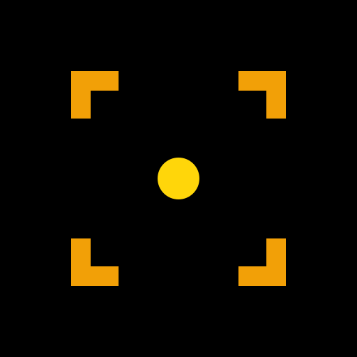
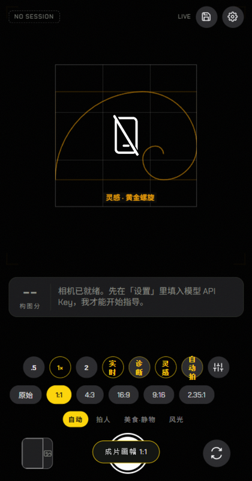
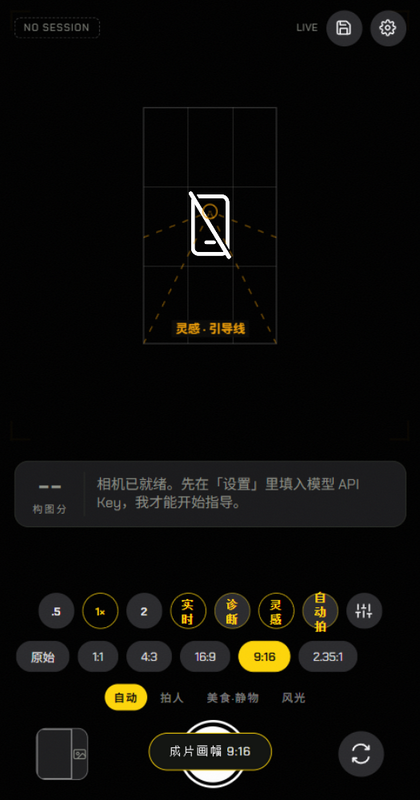

<div align="center">



# 构图教练 · Composition Coach

_手机上的相机 Agent —— 取景时实时给出构图引导、灵感模板、调色建议与画幅裁切，_
_用大白话告诉你「往左挪两步、蹲低一点、现在可以拍了」。_


面向**手机竖屏、单手持机、边取景边看引导**的真实拍摄场景设计。

</div>

---

## 📸 界面速览

| 黄金螺旋 · 1:1 画幅 | 引导线 · 9:16 画幅 |
|:---:|:---:|
|  |  |

## ✨ 功能特性

- **端侧实时教练（离线）**：MediaPipe 本地检测人脸/物体，逐帧给出当前位置框、
  目标位置框与动作指令，零 token、低延迟，默认自动开启
- **云端深度诊断**：接入任意 OpenAI 兼容视觉大模型（DeepSeek / 智谱 / 通义 /
  OpenRouter…），返回构图分、问题清单与动作指令；默认手动触发，token 可控
- **灵感构图模板**：按场景自动推荐三分法、中心对称、引导线、黄金螺旋等 8 种
  构图骨架，叠加在取景器上照着摆即可，无云端时本地兜底推荐
- **成片画幅比例**：1:1 / 4:3 / 16:9 / 9:16 / 2.35:1 实时遮罩取景器，成片同口径
  裁切；AI 可建议更合适的画幅，一键套用
- **AI 调色建议**：滤镜预览即所见、成片自动烘焙；云端按光线氛围推荐滤镜
- **会话存档复盘**：诊断过程 + 成片自动落盘 IndexedDB，回看时间线与构图分曲线，
  支持导出 JSON
- **相机能力**：硬件变焦优先（退化数字变焦）、前后摄切换、前置镜像校正、
  原始分辨率快门

## 📱 应用形态

| 组成 | 说明 |
|---|---|
| 取景引擎（本仓库主体） | Web 技术实现的相机应用核心：HTML/CSS/原生 ES Modules，无框架、无构建、零 npm 依赖 |
| Android 壳 | WebView 打包的调试 APK（`composition-coach-debug.apk`），**不入库**，请通过 [GitHub Releases](../../releases) 分发 |
| 本地 AI 资产 | `model/`（TFLite 模型）与 `vendor/`（MediaPipe 运行时）随源码同仓，保证离线可用 |

## 🚀 快速开始

环境要求：Node.js（任意较新版本，无第三方依赖）。

```bash
node server.js
```

打开 **http://localhost:5177**（端口被占用会自动顺延）。

> 相机与姿态传感器都要求**安全上下文**：`localhost` 可直接使用；
> 手机访问需要 HTTPS（内网穿透如 `npx localtunnel --port 5177`、ngrok，或
> 自签名证书），也直接安装 APK 使用。

## ⚙️ 配置模型

首次打开点右上角「设置」，选择服务商预设并填入自己的 API Key：

| 预设 | API 地址 | 视觉模型 |
|---|---|---|
| DeepSeek | `https://api.deepseek.com/v1` | `deepseek-v4-flash-vision-exp` |
| 智谱 | `https://open.bigmodel.cn/api/paas/v4` | `glm-4v-flash` |
| 通义 | `https://dashscope.aliyuncs.com/compatible-mode/v1` | `qwen-vl-flash` |
| OpenRouter | `https://openrouter.ai/api/v1` | 自行填写 |

任何 OpenAI 兼容的 `/chat/completions` 服务都可用「自定义」接入。

## 🔒 隐私与成本

- API Key 只存本机 localStorage；画面帧只发给你自己配置的服务商，本应用没有
  自己的服务器
- 耗 token 的功能默认关闭/手动触发；每次诊断仅上传 640px、JPEG 72% 的压缩帧

## 🗂️ 目录结构

```
composition-coach/
├── README.md                        # 本文件（项目门面 + 使用文档）
├── AGENTS.md                        # 项目约定（AI 协作必读）
├── DESIGN.md                        # 设计规范：暗房光学仪器设计语言
└── composition-coach-web-src/       # 全部源码
    ├── server.js                    # 零依赖静态服务器（localhost:5177）
    ├── index.html                   # 单页应用：取景器 / 档案 / 会话详情 / 设置
    ├── css/style.css                # 视觉主题（:root 设计令牌）
    ├── js/                          # camera / vlm / overlay / localcoach /
    │                                # templates / filters / sharecard / store / app
    ├── model/                       # 本地 TFLite 模型（人脸/物体检测）
    └── vendor/                      # MediaPipe 视觉运行时（离线推理）
```

## 🧨 设计规范与协作

- UI 一律遵循 [DESIGN.md](./DESIGN.md)（暗房光学仪器：纯黑画布、琥珀仪器光、
  胶囊控制），改样式先登记 token 再写代码
- AI 协作开发约定见 [AGENTS.md](./AGENTS.md)

## ⚠️ 已知限制

- VLM 的目标框是"大致框架"，非像素级精准框（产品设计如此）
- 水平仪依赖姿态传感器，需 HTTPS 安全上下文（iOS 还需用户手势授权）
- 前置镜像时文字指令的"左/右"可能与画面相反，以屏幕上的框和箭头为准
- 部分 Android WebView 内导出 JSON 可能不触发下载（浏览器版正常）

## 📄 许可证

尚未选择开源许可证。在添加 LICENSE 前，仓库内容默认保留所有权利。
